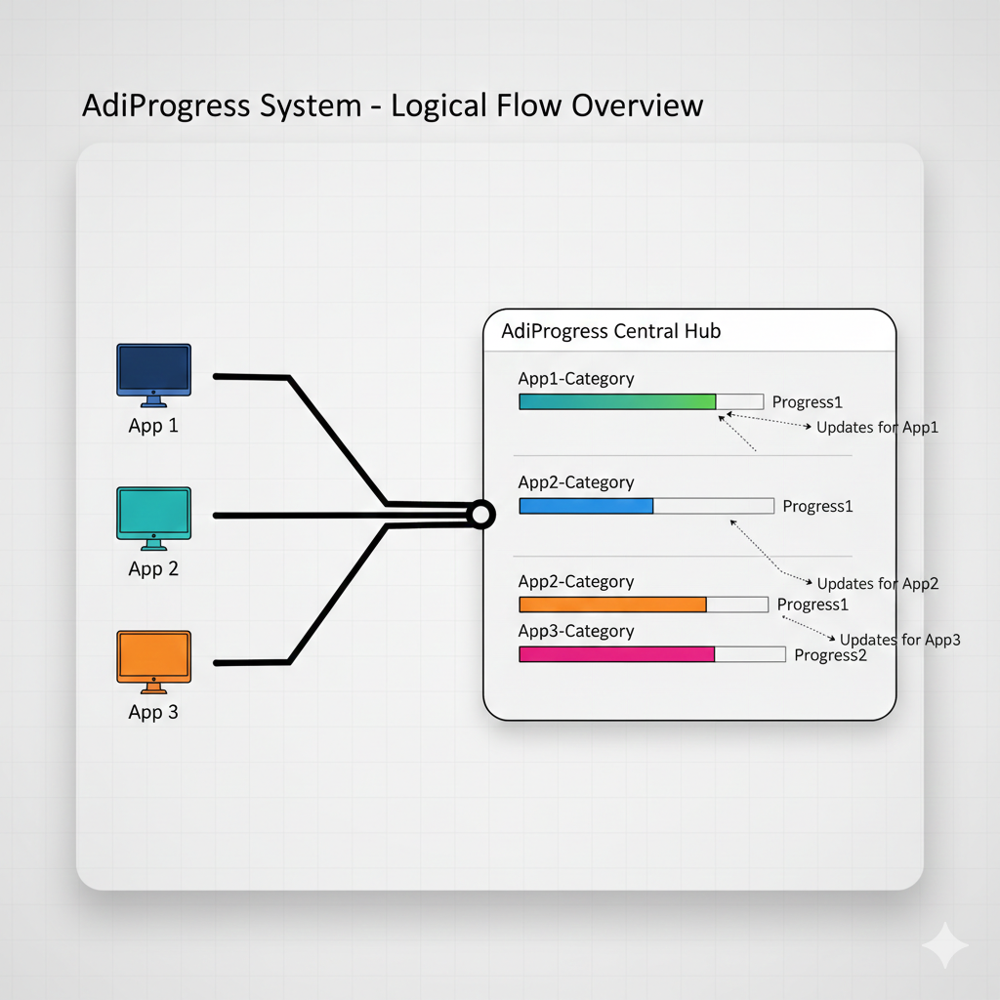
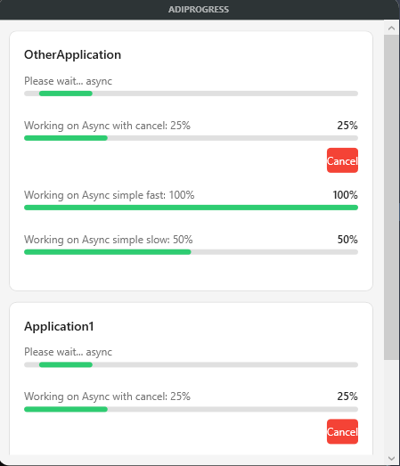

# AdiProgress

A centralized progress hub for Windows. Instead of every application spawning its own dialog, **AdiProgress** provides a single, consolidated window for all active tasks. It dynamically scales and adds scrollbars as more processes report in.





## Key Features
-   **Shared UI:** One window for multiple independent apps (categorized by name).
-   **IPC via Named Pipes:** Fast, version-independent communication between .NET 4.8 and .NET 8+.
-   **Self-Bootstrapping:** The client starts the server automatically if it’s not running.
-   **JSON Theming:** UI appearance is easily customizable via `appsettings.json`.

## Technical Architecture

-   **Server:** Standalone WPF application (**any .NET version**).
-   **Clients:** Lightweight Library supporting **.NET 4.8 to .NET 10**.
-   **Communication:** **Named Pipes** (allows cross-version compatibility).
-   **Deployment:** No Service required. Client launches the Server `.exe` on demand.
-   **Customization:** Appearance is configured via JSON (colors, fonts, etc.).
  
## Usage Example

### Configuration
```csharp
//Set the server path
AdiProgressClient.AdiProgressClient.ServerPath = @"c:\Tools\AdiProgress.exe";
```
### Synchronous Progress (Standard)
```csharp
using AdiProgressClient; // Add this to the top of your file

// Run a sync progress
using (var progress = new AdiProgress(name, allowCancel: true, parentHandle: Handle))
{
    for (int i = 0; i <= 100; i += 10)
    {
        progress.UpdateProgressSync(i, 100, $"Working on something important: {i}%");
        
        if (progress.IsCancelled) return; 
        
        Thread.Sleep(200);
    }
}
```
### Synchronous "Please Wait" (Marquee)
```csharp
// Run a sync marquee progress
using (var progress = new AdiProgress(name, allowCancel: true, parentHandle: Handle))
{
    progress.ShowPleaseWaitSync("Please wait...");
    Thread.Sleep(5000);
}
```

##  Asynchronous Progress

```csharp
// Run an async progress with a 500ms delay before showing UI
using (var progress = new AdiProgress(name, allowCancel: true, showAfterMs: 500))
{
    for (int i = 0; i <= 100; i += 10)
    {
        await progress.UpdateProgressAsync(i, 100, $"Working async: {i}%");
        await Task.Delay(200);
    }
}
```
## Example Project
To see how to integrate the AdiProgressbar, check out the [TestClient example](TestClient/Program.cs) which demonstrates multi-category reporting.

> [!NOTE]
> Architecture & IPC Performance During development, an external IPC-based (Named Pipes) progress system was tested. For high-speed file searching, cross-process communication can feel "heavy" or introduce latency due to pipe congestion.

> The project currently uses a local progress bar for an "instant-start" feel. If you have a high-performance solution for externalized progress reporting, feel free to submit a PR or open an issue!


